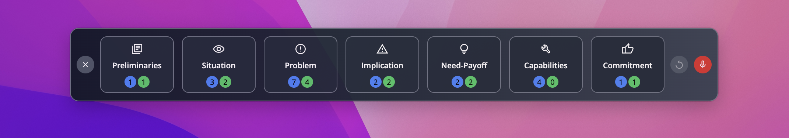

# Spinner: The Open Source Sales Copilot


**Spinner** is a tool for measuring and improving sales performance using the SPIN methodology. Based on the concepts in the **SPIN Selling** book, it provides a way to analyze sales conversations. The interface was created using [Webcrumbs Frontend AI](https://tools.webcrumbs.org).

## About Spinner

Spinner applies the SPIN methodology to sales training and performance measurement. It keeps data on the user’s device and avoids unnecessary complexity, offering an open-source solution.

### Features

- **SPIN Methodology Integration**: Analyze and improve sales techniques.
- **Local-Only Data**: Data is stored locally, except for calls to the OpenAI API.
- **Device Audio Monitoring**: Captures sound output for analysis.
- **OpenAI Integration**: Uses an OpenAI API key for conversation analysis.
- **Cross-Platform**: Built with Electron for desktop compatibility.
- **Open Source**: Licensed under AGPL.

## 🛠️ Getting Started

1. Clone the repository:

   ```bash
   git clone https://github.com/your-username/spinner.git
   cd spinner
   ```

2. Install it

   ```bash
   npm install && npm install --prefix frontend
   ```

3. Start the app:
   ```bash
   npm start
   ```

## User Interface

Spinner’s interface was built using [Webcrumbs Frontend AI](https://tools.webcrumbs.org). It is practical and designed to meet user needs. Explore it through this [link](https://share.webcrumbs.org/ne6ep_).



## License

Spinner is licensed under the **AGPL (GNU Affero General Public License)**, keeping it open and available for modification.

## Roadmap

Spinner is under development. Planned features include:

- **Real-Time Subtitles**: Generate live transcription.
- **Real-Time Scoring**: Apply SPIN scoring during conversations.
- **Recommendations**: Provide suggestions based on scoring.
- **Exporting Options**: Save audio, transcription, and reports.

## Contributing

Contributions are welcome. To contribute:

1. Fork the repository.
2. Create a branch for your changes.
3. Submit a pull request for review.

---

**Crafted by @heyjmac with [Webcrumbs](https://webcrumbs.org/frontend-ai)**
