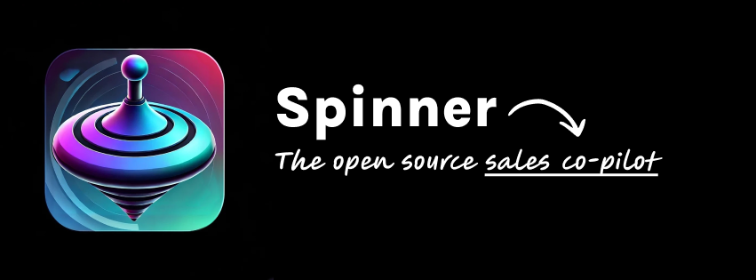

# Spinner: The Open Source Sales Copilot



Spinner is your sales copilot, helping you measure and improve sales performance using the proven SPIN methodology. Inspired by the **SPIN Selling** book and created with an interface designed using [Webcrumbs Frontend AI](https://tools.webcrumbs.org), Spinner brings cutting-edge technology to the world of sales training and performance measurement.

## 🔍 About Spinner

Sales performance measurement is often an overlooked challenge. Spinner bridges this gap by leveraging the SPIN methodology to provide actionable insights while keeping everything simple, secure, and open source.

### 🌟 Features

- **SPIN Methodology Integration**: Measure and improve your sales performance based on SPIN.
- **Local-Only Data**: No backend required! Data stays local with no external storage—except for the OpenAI API.
- **Device Sound Listening**: Spinner listens to the default sound output of your device for relevant cues.
- **OpenAI Integration**: Uses your OpenAI API key to analyze conversations. No configuration needed—just provide your key when prompted.
- **Cross-Platform**: Built with Electron for a seamless desktop experience.
- **Open Source**: Licensed under AGPL, contributions are welcome!

## 🛠️ Getting Started

1. Clone the repository:

   ```bash
   git clone https://github.com/your-username/spinner.git
   cd spinner
   ```

2. Install it

   ```bash
   npm install && npm install --prefix frontend
   ```

3. Start the app:
   ```bash
   npm start
   ```

## 🎨 User Interface

Spinner's interface was crafted using [Webcrumbs Frontend AI](https://tools.webcrumbs.org), showcasing the power of its AI-driven design capabilities. You can explore and tweak the Spinner interface directly via this [interactive link](https://tools.webcrumbs.org/example-link).

[](https://tools.webcrumbs.org/frontend-ai?hash=1cb9cbf1aeddf758d0d1d55b4d522e5c5baae74cb168ab37acd97d4a161833a2&theme=0ae8e5d839390452a0c940d5bd8b2f4d9d2a88de9448756bd5a6740d942fffab)

## 📚 License

Spinner is licensed under the **AGPL (GNU Affero General Public License)**. This ensures that Spinner and its derivatives remain free and open-source, fostering collaboration and innovation.

## 🚧 Roadmap

Spinner is still a work in progress. Upcoming features include:

- **Real-Time Subtitles**:...
- **Real-Time Scoring**: Implementing SPIN methodology scoring.
- **Real-Time Recommendations**: Implementing SPIN methodology scoring.
- **Exporting Options**: Export mp3, transcription and score report.

## 🤝 Contributing

We believe in the power of community! Contributions are welcome, whether it's code, design, documentation, or new feature ideas. Here's how you can contribute:

1. Fork the repository.
2. Create a new branch for your feature or fix.
3. Submit a pull request, and we'll review it as soon as possible.

---

Spinner is more than an app; it's a community-driven project aiming to revolutionize sales performance measurement. Let's make it better together!
